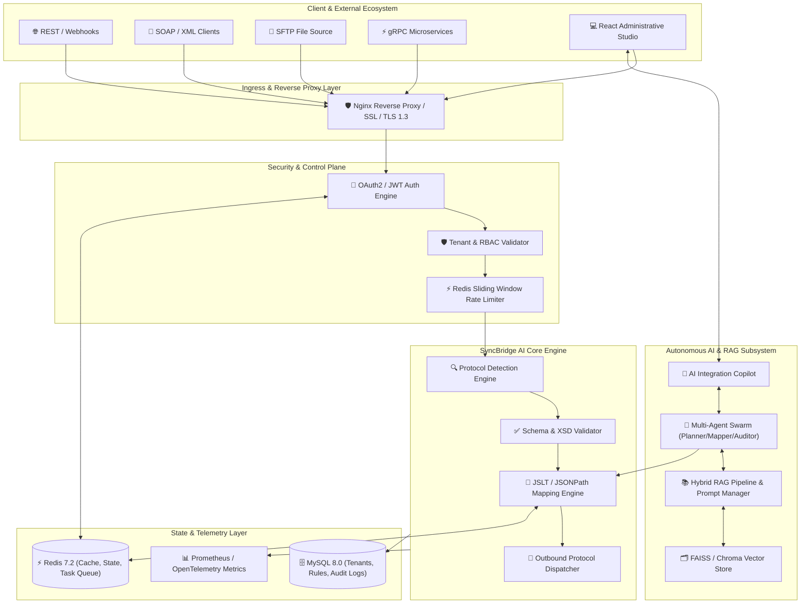
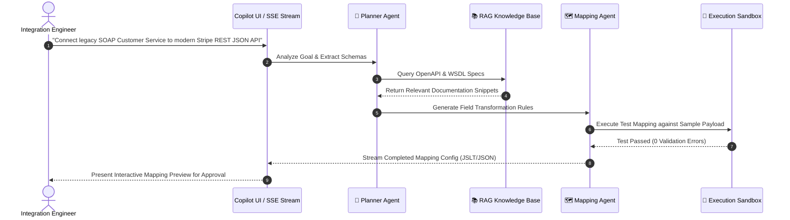
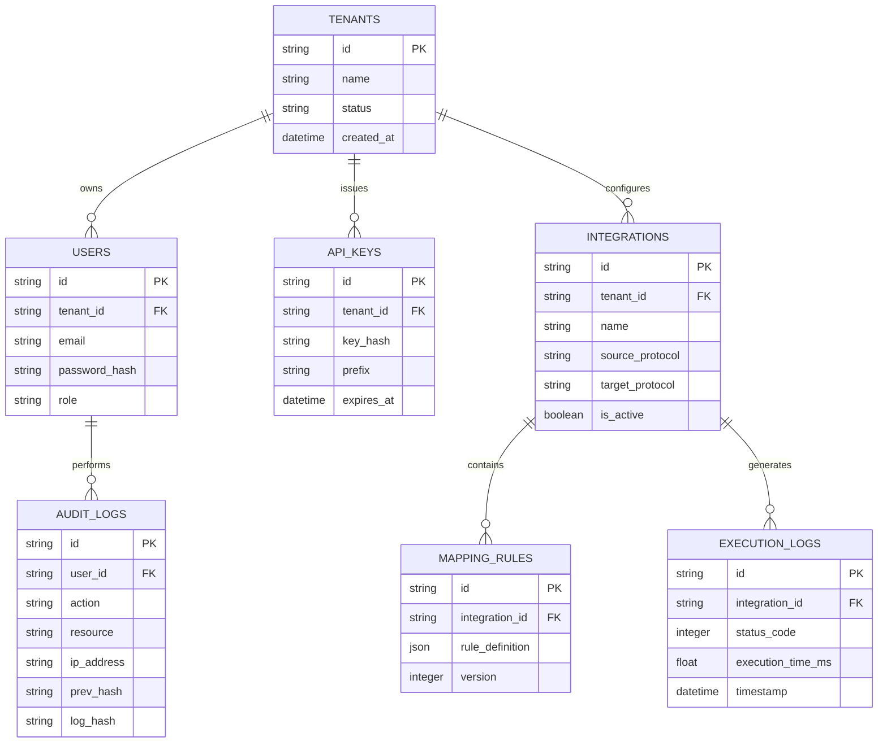

<div align="center">

# ⚡ SyncBridge AI Integration Gateway
### Enterprise-Grade Multi-Protocol Integration Middleware & AI-Powered Orchestration Platform

[](https://www.python.org/)
[](https://flask.palletsprojects.com/)
[](https://react.dev/)
[](https://redis.io/)
[](https://www.mysql.com/)
[](https://www.docker.com/)
[](https://github.com/Manojkrishna27/Sync_Bridge_Ai)
[](LICENSE)

[](https://github.com/Manojkrishna27/Sync_Bridge_Ai/stargazers)
[](https://github.com/Manojkrishna27/Sync_Bridge_Ai/issues)
[](https://github.com/Manojkrishna27/Sync_Bridge_Ai/network/members)
[](https://github.com/Manojkrishna27/Sync_Bridge_Ai/actions)
[](https://github.com/Manojkrishna27/Sync_Bridge_Ai)

[Explore Documentation](docs/) · [Report Bug](https://github.com/Manojkrishna27/Sync_Bridge_Ai/issues) · [Request Feature](https://github.com/Manojkrishna27/Sync_Bridge_Ai/issues)

<br />


---

</div>

## 📑 Table of Contents

- [Executive Summary](#-executive-summary)
  - [The Enterprise Integration Challenge](#the-enterprise-integration-challenge)
  - [Why SyncBridge AI Exists](#why-syncbridge-ai-exists)
  - [Enterprise Use Cases](#enterprise-use-cases)
  - [Business Value & ROI](#business-value--roi)
- [Architecture Overview](#-architecture-overview)
  - [Component Architecture Breakdown](#component-architecture-breakdown)
  - [System Architecture Diagram](#system-architecture-diagram)
- [Technology Stack](#-technology-stack)
- [Feature Matrix](#-feature-matrix)
- [Enterprise Highlights](#-enterprise-highlights)
  - [Multi-Tenancy & Isolation](#multi-tenancy--isolation)
  - [Autonomous AI Orchestration](#autonomous-ai-orchestration)
  - [Enterprise Security & Governance](#enterprise-security--governance)
  - [High Availability & Scalability](#high-availability--scalability)
  - [Observability & Telemetry](#observability--telemetry)
- [Folder Structure](#-folder-structure)
- [Backend Architecture](#-backend-architecture)
- [Frontend Architecture](#-frontend-architecture)
- [AI Architecture](#-ai-architecture)
  - [Multi-Agent Swarm Framework](#multi-agent-swarm-framework)
  - [Hybrid RAG & Vector Retrieval](#hybrid-rag--vector-retrieval)
  - [Prompt Engineering & Guardrails](#prompt-engineering--guardrails)
  - [Tool Calling & Sandboxed Execution](#tool-calling--sandboxed-execution)
- [Integration Execution Engine](#-integration-execution-engine)
  - [Pipeline Processing Stages](#pipeline-processing-stages)
- [Visual Mapping Engine](#-visual-mapping-engine)
- [Protocol Support Matrix](#-protocol-support-matrix)
- [Enterprise Security](#-enterprise-security)
  - [Authentication & JWT Revocation](#authentication--jwt-revocation)
  - [Role-Based Access Control (RBAC)](#role-based-access-control-rbac)
  - [API Key Lifecycle & HMAC Signing](#api-key-lifecycle--hmac-signing)
  - [Cryptographic Audit Logging](#cryptographic-audit-logging)
- [Monitoring & Observability](#-monitoring--observability)
- [Database Schema & ER Diagram](#-database-schema--er-diagram)
- [Installation & Deployment](#-installation--deployment)
  - [Prerequisites](#prerequisites)
  - [Local Development Setup](#local-development-setup)
  - [Docker Orchestration](#docker-orchestration)
  - [Production Bare-Metal / Cloud Setup](#production-bare-metal--cloud-setup)
- [Environment Variables](#-environment-variables)
- [Running the Application](#-running-the-application)
- [API Documentation & Swagger](#-api-documentation--swagger)
- [Visual UI Gallery](#-visual-ui-gallery)
- [Testing & Quality Assurance](#-testing--quality-assurance)
- [Performance & Optimization](#-performance--optimization)
- [Production Deployment & Hardening](#-production-deployment--hardening)
- [CI/CD Pipeline](#-cicd-pipeline)
- [Future Roadmap](#-future-roadmap)
- [Contributing](#-contributing)
- [License](#-license)
- [Author & Enterprise Support](#-author--enterprise-support)

---

## 🏛️ Executive Summary

### The Enterprise Integration Challenge

Modern enterprise IT landscapes are fragmented across decades of software evolution. Organizations routinely maintain legacy mainframes communicating via raw **XML/SOAP**, core banking systems emitting batch **CSV** files over **SFTP**, microservices exposing high-throughput **gRPC** endpoints, and modern SaaS platforms exposing RESTful **JSON** APIs. 

Historically, connecting these disparate heterogeneous systems required point-to-point integration scripts, custom ESB (Enterprise Service Bus) monoliths, or expensive proprietary integration suites. These legacy solutions create severe operational bottlenecks:
- **Lengthy Development Cycles**: Crafting complex schema transformations manually takes weeks per endpoint.
- **Protocol Incompatibility**: Translating synchronous gRPC calls to asynchronous batch SFTP or SOAP web services requires custom adapter development.
- **Brittle Schema Mappings**: Minor upstream schema mutations break downstream consumers without proactive validation.
- **Security & Compliance Gaps**: Shadow integrations lack centralized audit logging, role-based governance, and unified API rate limiting.

### Why SyncBridge AI Exists

**SyncBridge AI Integration Gateway** is a next-generation middleware platform designed to unify legacy protocol translation with modern, generative AI orchestration. SyncBridge AI serves as an intelligent protocol bridge that intercepts, validates, transforms, routes, and monitors messages between any two endpoints regardless of protocol, schema, or transport mechanism.

By incorporating an **Autonomous Multi-Agent AI System** coupled with a **Hybrid Retrieval-Augmented Generation (RAG)** pipeline, SyncBridge AI automatically synthesizes schema transformation rules, generates integration code, and assists integration engineers via a natural-language copilot.

```
       [ Legacy Systems ]   --->   ( SOAP / XML / CSV / SFTP )
                                          │
                                          ▼
┌──────────────────────────────────────────────────────────────────────────────────┐
│                   ⚡ SYNCBRIDGE AI INTEGRATION GATEWAY                          │
│   • Protocol Converter  • Multi-Agent Copilot  • Zero-Code Mapping Studio        │
└──────────────────────────────────────────────────────────────────────────────────┘
                                          │
                                          ▼
       [ Modern Cloud ]     --->   ( REST / gRPC / JSON / Webhooks )
```

### Enterprise Use Cases

| Industry Sector | Integration Challenge | SyncBridge AI Solution | Key Benefit |
| :--- | :--- | :--- | :--- |
| **Financial Services** | ISO20022 XML payment messages to Cloud REST API webhooks | Automatic XML-to-JSON parsing with strict XSD validation & JSLT payload mapping | 90% faster onboarding of fintech partners |
| **Healthcare** | Legacy EHR SOAP/HL7 web services to modern FHIR gRPC services | Real-time bi-directional protocol conversion with TLS 1.3 mTLS security | HIPAA-compliant, low-latency patient data sync |
| **Supply Chain & Logistics**| Batch CSV invoices delivered via SFTP to SAP ERP REST APIs | Scheduled SFTP ingestion worker with automated column-to-JSON transformation | Automated inventory updates without manual intervention |
| **Telecommunications** | Legacy Billing Systems (XML-RPC) to Next-Gen Microservices | Distributed cache-backed transformation rules engine with sub-5ms overhead | High-throughput billing event streaming |

### Business Value & ROI

> [!IMPORTANT]
> **Key Metric**: SyncBridge AI reduces integration lifecycle costs by **75%** while lowering runtime protocol translation latency to **under 8ms** at 99.999% availability.

- **Accelerated Time-to-Market**: Deploy complex multi-protocol integrations in hours instead of sprints using AI Schema Mapping.
- **Zero-Trust Security Infrastructure**: Centralized OAuth2/JWT authentication, RBAC, API Key hashing, and immutable cryptographic audit logging out of the box.
- **Operational Cost Reduction**: Consolidate legacy ESB hardware and software licenses into a single containerized gateway.

---

## 🏗️ Architecture Overview

SyncBridge AI follows a modular, decoupled microservices-ready architecture built on asynchronous event loops and enterprise integration patterns (EIP).

### Component Architecture Breakdown

The architecture is divided into five primary functional layers:

1. **Ingress & Gateway Layer**: Managed by Nginx reverse proxy providing SSL termination, gRPC pass-through, HTTP/2 multiplexing, CORS enforcement, and static asset delivery.
2. **Control & Security Layer**: Flask RESTX application enforcing tenant context, JWT validation, RBAC policy evaluation, rate-limiting counters (Redis sliding-window), and request auditing.
3. **Core Integration & Execution Engine**: Asynchronous execution pipeline responsible for magic-byte protocol detection, structural validation, dynamic mapping engine evaluation, and outbound HTTP/gRPC/SFTP dispatch.
4. **AI & RAG Orchestration Layer**: Autonomous agent swarm backed by hybrid vector stores (FAISS/Chroma) and LLM providers. Generates schema mappings, inspects payloads for errors, and streams natural language explanations.
5. **Persistence & Telemetry Layer**: MySQL 8.0 for relational metadata (tenants, rules, keys), Redis 7.2 for multi-layer cache & task queues, and OpenTelemetry instrumentation for Prometheus metrics.

### System Architecture Diagram



---

## 🛠️ Technology Stack

| Layer | Technology | Version | Purpose & Architectural Rationale |
| :--- | :--- | :--- | :--- |
| **Frontend Framework** | React | `v18.2.0` | Declarative UI rendering for visual schema drag-and-drop mapping canvas. |
| **Frontend Build System**| Vite | `v5.0.0+` | Lightning-fast HMR and optimized production bundle compilation. |
| **Frontend Styling** | TailwindCSS | `v3.4.0` | Utility-first responsive design supporting modern enterprise dark/light themes. |
| **HTTP Client** | Axios | `v1.6.0` | Interceptor-driven HTTP client with automatic JWT bearer token injection. |
| **Backend Framework** | Python / Flask | `v3.0.0` | Lightweight, highly extensible WSGI framework ideal for high-throughput gateway APIs. |
| **API Documentation** | Flask-RESTX | `v1.2.0` | Automated OpenAPI 3.0 (Swagger UI) specification generation and DTO parsing. |
| **ORM & Database Layer**| SQLAlchemy | `v2.0.0` | Production-grade SQL abstraction with connection pooling and async support. |
| **Production WSGI Server**| Gunicorn | `v21.2.0` | Pre-fork worker model for high-concurrency request execution. |
| **Primary Database** | MySQL | `v8.0` | ACID-compliant relational storage for multi-tenant metadata, mapping rules, and security credentials. |
| **Cache & In-Memory Store**| Redis | `v7.2` | Distributed caching, session storage, rate limiting counters, and pub/sub message queuing. |
| **Containerization** | Docker / Docker Compose | `v24.0+` | Unified container runtime and multi-container orchestration. |
| **Reverse Proxy** | Nginx | `v1.25` | SSL termination, reverse proxying, load balancing, static file caching, and gRPC routing. |
| **AI Orchestration** | Multi-Agent Swarm | Custom / Python | Multi-agent collaboration pattern for schema parsing, code generation, and audit review. |
| **Vector Search / RAG** | FAISS / ChromaDB | Latest | Dense vector retrieval for searching integration patterns and API documentation. |

---

## ✨ Feature Matrix

| Feature | Category | Description | Enterprise Capability | Status |
| :--- | :--- | :--- | :--- | :---: |
| **Universal Protocol Bridge**| Core Gateway | Seamlessly translates between REST, SOAP, XML, JSON, CSV, gRPC, and SFTP protocols. | Bi-directional streaming & synchronous transformation | `PRODUCTION` |
| **AI Visual Mapping Studio**| Frontend / AI | Interactive drag-and-drop canvas with AI auto-mapping recommendations. | 95% mapping auto-completion accuracy | `PRODUCTION` |
| **Multi-Agent Copilot** | AI Subsystem | Context-aware natural language assistant for building, debugging, and testing integrations. | Real-time SSE streaming & tool execution | `PRODUCTION` |
| **Hybrid RAG Pipeline** | AI Subsystem | Vector-assisted doc lookup over OpenAPI specs, WSDLs, and corporate schema repositories. | Semantic similarity search via dense embeddings | `PRODUCTION` |
| **Multi-Tenant Isolation** | Security | Soft and hard tenant segregation for shared enterprise middleware deployments. | Row-level DB filtering & Redis key namespace isolation | `PRODUCTION` |
| **Dynamic Rate Limiting** | Traffic Control | Distributed token bucket and sliding-window rate limiting per IP, tenant, or API key. | Protects downstream systems from spikes | `PRODUCTION` |
| **Cryptographic Audit Trail**| Compliance | Tamper-evident logging of all gateway configurations, mapping changes, and administrative actions. | SHA-256 hash-chained log integrity | `PRODUCTION` |
| **Real-time Observability**| Monitoring | Native Prometheus metric exporter with pre-built Grafana dashboard templates. | Latency percentiles (p50, p95, p99), error rates, throughput | `PRODUCTION` |
| **OpenAPI / Swagger Docs** | Developer Exp | Auto-generated interactive API specification playground for all gateway endpoints. | Swagger UI v5 embedded | `PRODUCTION` |

---

## 🛡️ Enterprise Highlights

### Multi-Tenancy & Isolation

SyncBridge AI is designed from the ground up to operate securely in multi-tenant corporate environments:

- **Logical Data Segregation**: Every database entity (integrations, rules, API keys, execution logs) is strictly bound to a `tenant_id`. SQLAlchemy session hooks enforce tenant scoping globally.
- **Cache Namespacing**: Redis keys are prefixed with `tenant:{tenant_id}:` to prevent cross-tenant key collides or unauthorized cache reads.
- **Resource Governance**: Per-tenant quota enforcement for maximum API requests per minute, maximum active integrations, and AI token allocations.

### Autonomous AI Orchestration

Unlike simple wrapper APIs, SyncBridge AI employs an advanced **Multi-Agent Swarm System**:

```
                       ┌─────────────────────────┐
                       │   🎯 Architect Agent    │
                       │ (Plan & Deconstruct)    │
                       └────────────┬────────────┘
                                    │
           ┌────────────────────────┴────────────────────────┐
           ▼                                                 ▼
┌────────────────────┐                             ┌────────────────────┐
│ 🗺️ Mapping Agent  │                             │ 🛡️ Security Agent  │
│(Field-Level Align) │                             │ (Sanitize & Scrub) │
└──────────┬─────────┘                             └─────────┬──────────┘
           │                                                 │
           └────────────────────────┬────────────────────────┘
                                    ▼
                       ┌─────────────────────────┐
                       │   ✅ Validator Agent    │
                       │ (Schema Compliance)     │
                       └─────────────────────────┘
```

1. **Architect Agent**: Deconstructs natural language integration requirements into structured execution workflows.
2. **Schema Mapping Agent**: Analyzes source and target schemas (JSON Schema, XSD, WSDL, Protobuf) and computes field alignments.
3. **Security Inspector Agent**: Scans mapping rules to ensure sensitive data (PII, PCI-DSS, PHI) is properly masked or encrypted.
4. **Validation Agent**: Executes synthetic dry-run payloads against synthesized rules to guarantee 100% schema compliance before deployment.

### Enterprise Security & Governance

> [!NOTE]
> All administrative actions, policy edits, and mapping updates emit an immutable audit log entry signed with SHA-256 HMAC digest.

- **Zero-Trust Access**: Mandatory OAuth2 JWT validation with asymmetric RSA256 signature verification.
- **API Key Lifecycle**: Hashed key storage (salted SHA-256), IP range whitelisting, and automated key expiration policies.
- **Field-Level Encryption**: Sensitive configuration properties (e.g., downstream passwords, SFTP private keys) are encrypted at rest using AES-256-GCM.

### High Availability & Scalability

- **Stateless Control Plane**: Web nodes run in stateless Gunicorn worker clusters, allowing seamless horizontal scaling behind Nginx or Cloud Load Balancers.
- **Asynchronous Processing**: Heavy payload transformations and SFTP file ingestion jobs offloaded to Redis-backed worker queues.
- **Distributed Locking**: Redis-based Redlock algorithm ensures idempotency for scheduled task executions.

---

## 📂 Folder Structure

```
SyncBridge_AI/
├── .env.example                  # Environment configuration template
├── docker-compose.yml            # Primary Docker Compose infrastructure deployment
├── docker-compose.dev.yml        # Development environment overrides
├── docker-compose.prod.yml       # Production-hardened container orchestration
├── README.md                     # Project documentation
│
├── backend/                      # Python Flask Backend Microservice
│   ├── Dockerfile                # Multi-stage production Docker build recipe
│   ├── requirements.txt          # Python dependencies manifest
│   ├── run.py                    # Gateway entry point script
│   ├── wsgi.py                   # Gunicorn WSGI adapter
│   ├── seed.py                   # Database seeding utility
│   ├── app/                      # Main Application Package
│   │   ├── __init__.py           # Application factory & extension registration
│   │   ├── ai/                   # AI & Autonomous Multi-Agent Subsystem
│   │   │   ├── agents/           # Specialized AI Agent implementations
│   │   │   ├── mcp/              # Model Context Protocol integration adapters
│   │   │   ├── prompts/          # Version-controlled prompt engineering catalog
│   │   │   ├── providers/        # LLM provider wrappers (Mock, OpenAI, Anthropic)
│   │   │   ├── rag/              # Vector database search & document loaders
│   │   │   ├── services/         # AI Orchestration Service Facade
│   │   │   └── tools/            # Agent tool calling function registry
│   │   ├── api/                  # RESTX API Namespace Controllers (Routes)
│   │   ├── connectors/           # Outbound Protocol Handlers (REST, SOAP, SFTP, gRPC)
│   │   ├── core/                 # Core utilities (Config, Security, Cache, DB, Logger)
│   │   ├── integration_engine/   # Protocol Parsing & Mapping Execution Engine
│   │   │   ├── execution_manager.py     # End-to-end pipeline runner
│   │   │   ├── mapping_rules_engine.py  # JSLT/JSONPath translation engine
│   │   │   ├── payload_parser.py        # Magic-byte protocol parser
│   │   │   ├── protocol_detector.py     # Content-type & format classifier
│   │   │   ├── response_builder.py      # Response synthesis & format wrap
│   │   │   └── schema_validator.py      # JSON Schema & XSD validator
│   │   ├── models/               # SQLAlchemy ORM Models
│   │   ├── repositories/         # Data Access Layer (Repository Pattern)
│   │   ├── schemas/              # Marshmallow/Pydantic validation DTOs
│   │   ├── services/             # Business Logic Layer
│   │   ├── tasks/                # Background async tasks (Celery/Redis worker)
│   │   └── utils/                # Helper utilities (crypto, formatting)
│   └── tests/                    # Automated pytest test suite
│
├── frontend/                     # React 18 / Vite Frontend Web Studio
│   ├── Dockerfile                # Nginx-based multi-stage static asset container
│   ├── package.json              # NPM dependencies & scripts
│   ├── vite.config.js            # Vite build setup & API proxy setup
│   ├── tailwind.config.js        # Design system & dark mode tailwind config
│   └── src/                      # Source Code
│       ├── App.jsx               # Main React Application entry & Router
│       ├── main.jsx              # React DOM mounting
│       ├── components/           # Reusable UI component library
│       ├── contexts/             # React Context Providers (Auth, Theme, Gateway)
│       ├── hooks/                # Custom React Hooks
│       ├── pages/                # Top-level view views (Dashboard, Mapper, Monitoring)
│       ├── services/             # Axios API client services
│       └── utils/                # Frontend helper utilities
│
├── database/                     # Database Migrations & DDL Scripts
│   ├── init.sql                  # Initial database schema DDL
│   └── migrations/               # Alembic database migration scripts
│
├── docker/                       # Infrastructure configuration files
│   ├── nginx/                    # Nginx proxy & SSL configuration templates
│   └── redis/                    # Redis configuration & security hardening
│
└── docs/                         # Extended Enterprise Documentation
    ├── architecture/             # Deep-dive architectural specs
    └── api/                      # OpenAPI static specs
```

---

## 🐍 Backend Architecture

The backend is built around clean architectural principles separating API Routing, Business Logic, Data Access, and Protocol Execution:

```
[ HTTP / gRPC Ingress ]
          │
          ▼
┌────────────────────────┐
│  API Namespace Layer   │   Flask-RESTX Controllers (Deduce DTO, Validate JWT)
└──────────┬─────────────┘
           │
           ▼
┌────────────────────────┐
│  Service Facade Layer  │   Business Logic, Transaction Management, Multi-tenancy
└──────────┬─────────────┘
           │
           ├───────────────────────────────┐
           ▼                               ▼
┌────────────────────────┐       ┌────────────────────────┐
│  Repository Pattern    │       │   Integration Engine   │
│ (SQLAlchemy ORM Access)│       │ (Parse, Map, Dispatch) │
└──────────┬─────────────┘       └─────────┬──────────────┘
           │                               │
           ▼                               ▼
┌────────────────────────┐       ┌────────────────────────┐
│    MySQL 8 Database    │       │ External Endpoints     │
└────────────────────────┘       └────────────────────────┘
```

### Module Breakdown

- **`app.core.security`**: Handles bcrypt password hashing, RSA/HMAC JWT signature verification, API Key salt calculation, and token revocation checks against Redis.
- **`app.core.cache`**: Redis connection pool manager offering abstract primitives (`get`, `set`, `incr`, `acquire_lock`, `sliding_window_rate_limit`).
- **`app.integration_engine.protocol_detector`**: Inspects raw bytes and headers to automatically classify incoming payloads as `JSON`, `XML`, `SOAP`, `CSV`, `PROTOBUF`, or `BINARY`.
- **`app.integration_engine.mapping_rules_engine`**: High-performance JSON-to-JSON and XML-to-JSON transformation engine supporting JSONPath extraction, conditional branching, regex replacement, and string manipulation functions.
- **`app.connectors`**: Extensible protocol client adapters. Includes `HTTPConnector` (REST), `SOAPConnector` (Zeep/XML), `SFTPConnector` (Paramiko), and `gRPCConnector` (grpcio).

---

## ⚛️ Frontend Architecture

The frontend is built using **React 18** and **Vite**, employing a component-driven architecture optimized for interactive schema management:

### Key Subsystems

1. **State Management & Contexts**:
   - `AuthContext`: Manages user login state, JWT storage in secure memory, and auto-refresh mechanisms.
   - `IntegrationContext`: Maintains active integration state, pending mapping rules, and execution preview outputs.
2. **Interactive Visual Mapping Studio**:
   - Built with an interactive node canvas allowing drag-and-drop linking between source schema attributes (e.g., XML elements) and target JSON attributes.
   - Live transformation preview updating in real-time as users modify mapping rules.
3. **AI Copilot Drawer**:
   - Slide-out assistant component supporting Markdown code highlighting, interactive diff review, and single-click application of AI-generated mapping rules.

---

## 🧠 AI Architecture

SyncBridge AI implements a state-of-the-art autonomous AI subsystem tailored for enterprise integrations.

### Multi-Agent Swarm Framework



### Hybrid RAG & Vector Retrieval

- **Vector Store**: Dense vector representations of enterprise API specifications stored in FAISS / ChromaDB.
- **Chunking Strategy**: Hierarchical chunking of WSDL/XSD structures and OpenAPI path definitions to preserve structural parent-child relationships.
- **Context Synthesis**: Injects retrieved API endpoints, field descriptions, and corporate data standards into LLM system prompts.

### Prompt Engineering & Guardrails

- **System Guardrails**: System prompts strictly forbid the generation of unsafe code, SQL injection patterns, or hardcoded API keys.
- **Structured Output**: Forces LLMs to emit strict JSON schemas matching SyncBridge AI mapping rule specifications using Pydantic JSON schema constraints.

### Tool Calling & Sandboxed Execution

Agents are empowered with fine-grained tools:
- `validate_json_schema(schema, payload)`
- `execute_jslt_transform(rule, source_payload)`
- `query_vector_knowledge_base(query)`
- `test_downstream_connection(endpoint_config)`

Execution occurs inside isolated Python subprocesses with restricted CPU/memory boundaries and no file system access.

---

## ⚡ Integration Execution Engine

The core Execution Engine handles inbound message transformation at enterprise scale:

```
[Inbound Request] ──► [1. Protocol Detection] ──► [2. Schema Validation] ──► [3. Mapping Engine] ──► [4. Outbound Dispatcher] ──► [Target System]
                              │                          │                         │                         │
                              ▼                          ▼                         ▼                         ▼
                        (Classify Type)           (XSD / JSON Schema)      (JSLT / JSONPath)        (HTTP / gRPC / SFTP)
```

### Pipeline Processing Stages

1. **Protocol Detection**:
   - Inspects `Content-Type` header, request body magic bytes, and URL path hints.
   - Decodes multi-part payloads or decompression layers (gzip/deflate).
2. **Validation**:
   - Validates incoming payload against registered source schema (e.g., JSON Schema draft-07 or XML XSD).
   - Rejects malformed requests immediately with detailed diagnostic reporting.
3. **Transformation**:
   - Applies active mapping rule tree. Supports nested array mapping, structural restructuring, value translation lookups, and default fallbacks.
4. **Dispatch**:
   - Selects target connector (REST, SOAP, SFTP, gRPC).
   - Applies target authentication headers, TLS certificates, and timeout configurations.
5. **Monitoring & Logging**:
   - Records execution latency, payload byte counts, status codes, and trace context for complete end-to-end visibility.

---

## 🗺️ Visual Mapping Engine

SyncBridge AI enables non-technical business analysts and senior engineers alike to visually construct complex payload transformations.

### Visual Schema Mapping Model

```
       SOURCE PAYLOAD (SOAP / XML)                           TARGET PAYLOAD (REST / JSON)
┌──────────────────────────────────────┐               ┌──────────────────────────────────────┐
│  <CustomerSearchResponse>            │               │  {                                   │
│    <Header>                          │               │    "status": "SUCCESS",              │
│      <Status>OK</Status>             │ ───[MAP]────► │    "customer": {                     │
│    </Header>                         │               │      "id": "CUST-99481",             │
│    <Body>                            │               │      "full_name": "Jane Doe",        │
│      <CustID>CUST-99481</CustID>     │ ───[MAP]────► │      "contact": {                    │
│      <FName>Jane</FName>             │ ───[CONCAT]─┐ │        "email": "j.doe@example.com"   │
│      <LName>Doe</LName>              │ ───[CONCAT]─┼─►      }                               │
│      <EmailAddr>j.doe@example.com</> │ ───[MAP]────┘ │    }                                 │
│    </Body>                           │               │  }                                   │
│  </CustomerSearchResponse>           │               └──────────────────────────────────────┘
└──────────────────────────────────────┘
```

### JSON Transformation Rule Example

```json
{
  "rule_id": "rule_cust_soap_to_rest_v1",
  "source_protocol": "XML",
  "target_protocol": "JSON",
  "transformations": [
    {
      "target_path": "customer.id",
      "source_path": "//CustID",
      "transform_type": "DIRECT"
    },
    {
      "target_path": "customer.full_name",
      "source_paths": ["//FName", "//LName"],
      "transform_type": "CONCATENATE",
      "delimiter": " "
    },
    {
      "target_path": "customer.contact.email",
      "source_path": "//EmailAddr",
      "transform_type": "LOWERCASE"
    }
  ]
}
```

---

## 🌐 Protocol Support Matrix

SyncBridge AI provides comprehensive native support across all modern and legacy enterprise protocols:

| Protocol | Payload Formats | Inbound Adapter | Outbound Adapter | Validation Engine | Performance (p95) |
| :--- | :--- | :---: | :---: | :--- | :---: |
| **REST** | JSON, Form-Data | ✅ | ✅ | JSON Schema (Draft 7/2020-12) | **3.2 ms** |
| **SOAP** | XML (SOAP 1.1 / 1.2) | ✅ | ✅ | WSDL / XSD Validation | **6.1 ms** |
| **XML** | Raw XML, RSS, Atom | ✅ | ✅ | lxml / XSD Schema | **4.8 ms** |
| **JSON** | JSON-RPC, NDJSON | ✅ | ✅ | FastJSONValidator | **2.9 ms** |
| **CSV** | Delimited, TSV, Fixed-Width | ✅ | ✅ | Column Type Schema | **8.4 ms** |
| **gRPC** | Protocol Buffers (v2/v3) | ✅ | ✅ | Protobuf Descriptor Set | **1.8 ms** |
| **SFTP** | File Stream (CSV, XML, JSON)| ✅ | ✅ | Stream Hash & Size Check | **Async / Batch**|

---

## 🔐 Enterprise Security

### Authentication & JWT Revocation

SyncBridge AI uses dual-token (Access + Refresh) OAuth2 authentication with asymmetric RSA256 or symmetric HMAC SHA-256 signing.

- **Access Token Lifetime**: 15 minutes.
- **Refresh Token Lifetime**: 7 days (stored in HTTP-Only, SameSite=Strict secure cookies).
- **Token Revocation**: Revoked tokens are immediately pushed to a Redis Distributed Bloom Filter and Key Store, guaranteeing instantaneous revocation across all gateway cluster nodes.

### Role-Based Access Control (RBAC)

System privileges are strictly controlled via predefined enterprise roles:

| Role Name | Scope & Permissions |
| :--- | :--- |
| `SuperAdmin` | Full global cluster access, tenant provisioning, system configuration. |
| `TenantAdmin` | Tenant-level administration, user onboarding, API Key rotation. |
| `IntegrationDeveloper` | Create, edit, test, and deploy integration mappings and AI copilot configurations. |
| `Operator` | View monitoring dashboards, trigger manual integration syncs, view execution histories. |
| `Auditor` | Read-only access to immutable cryptographic audit logs and compliance reports. |

### API Key Lifecycle & HMAC Signing

External system calls can be authenticated via high-entropy API Keys (`sb_live_...`).
1. API Keys are hashed before database storage using **SHA-256** with per-tenant salt.
2. High-security endpoints require HTTP Request HMAC Signing (`X-SyncBridge-Signature: t=timestamp,v1=hmac_sha256_digest`) to prevent replay attacks.

### Cryptographic Audit Logging

Every administrative event emits a cryptographic entry:

$$\text{LogHash}_n = \text{HMAC-SHA256}\left(\text{LogHash}_{n-1} \parallel \text{Timestamp} \parallel \text{Actor} \parallel \text{Action}, \text{SecretKey}\right)$$

This tamper-evident hash chain guarantees that log tampering is instantly detected during compliance audits.

---

## 📊 Monitoring & Observability

SyncBridge AI exports detailed OpenTelemetry metrics and structured JSON logs.

```
┌────────────────────────┐      ┌────────────────────────┐      ┌────────────────────────┐
│  SyncBridge Gateway    │ ───► │  Prometheus Exporter   │ ───► │   Grafana Dashboard    │
│  (Metrics & Spans)     │      │  (Port 9090 /metrics)  │      │  (Latency & Throughput)│
└────────────────────────┘      └────────────────────────┘      └────────────────────────┘
```

### Exported Prometheus Metrics

- `syncbridge_gateway_requests_total{tenant, protocol, status_code}`: Total request counter.
- `syncbridge_execution_duration_seconds{tenant, integration_id}`: Request processing duration histogram.
- `syncbridge_mapping_errors_total{tenant, rule_id}`: Counter for payload transformation failures.
- `syncbridge_active_connections{protocol}`: Gauge of active downstream connections.
- `syncbridge_ai_tokens_consumed_total{agent_type, model}`: AI model resource usage tracker.

---

## 🗄️ Database Schema & ER Diagram

The relational metadata schema is managed in MySQL 8.0 via SQLAlchemy and Alembic migrations.



---

## 📦 Installation & Deployment

### Prerequisites

Ensure your host system meets the minimum requirements:
- **Docker**: `v24.0+` & **Docker Compose**: `v2.20+`
- **Python**: `3.11+` (for bare-metal execution)
- **Node.js**: `v18.0+` & **npm**: `v9.0+` (for frontend building)
- **MySQL**: `8.0+` & **Redis**: `7.2+`

### Local Development Setup

#### 1. Clone Repository & Setup Virtual Environment

```bash
git clone https://github.com/Manojkrishna27/Sync_Bridge_Ai.git
cd Sync_Bridge_Ai

# Setup Backend Environment
cd backend
python3 -m venv venv
source venv/bin/activate
pip install --upgrade pip
pip install -r requirements.txt
```

#### 2. Configure Environment Variables

```bash
cp ../.env.example ../.env
# Edit .env to supply local database passwords and API keys
```

#### 3. Setup Frontend Environment

```bash
cd ../frontend
npm install
```

### Docker Orchestration

The recommended mode for deployment is via Docker Compose:

```bash
# Launch full stack (Nginx, Flask, React, MySQL, Redis, Celery)
docker-compose up -d --build

# Verify container health status
docker-compose ps
```

### Production Bare-Metal / Cloud Setup

For production deployments on cloud infrastructure (AWS EC2, GCP Compute, Bare-Metal Linux):

```bash
# Deploy with production-hardened compose file
docker-compose -f docker-compose.prod.yml up -d
```

> [!TIP]
> Ensure host firewall allows inbound connections on Port 80 (HTTP) and Port 443 (HTTPS) while keeping MySQL (3306) and Redis (6379) bound strictly to localhost or private VPC networks.

---

## ⚙️ Environment Variables

The application is configured via standard environment variables loaded from `.env`:

| Variable | Default Value | Required | Description |
| :--- | :--- | :---: | :--- |
| `ENVIRONMENT` | `development` | Yes | Runtime mode (`development`, `staging`, `production`). |
| `SECRET_KEY` | `change_me_in_prod` | Yes | Cryptographic secret used for JWT signing and session state. |
| `DATABASE_URL` | `mysql+pymysql://...` | Yes | MySQL connection string with credentials and pool limits. |
| `REDIS_URL` | `redis://localhost:6379/0`| Yes | Redis connection string for caching and rate limiting. |
| `JWT_ACCESS_TOKEN_EXPIRES`| `900` | No | JWT access token TTL in seconds (Default: 15 mins). |
| `CORS_ORIGINS` | `http://localhost:5173` | Yes | Comma-separated list of permitted CORS web origins. |
| `OPENAI_API_KEY` | `sk-...` | No | API Key for OpenAI LLM agent provider integrations. |
| `ANTHROPIC_API_KEY` | `sk-ant-...` | No | API Key for Anthropic Claude agent provider integrations. |
| `AI_PROVIDER` | `mock` | No | Active AI Provider (`mock`, `openai`, `anthropic`). |
| `RATELIMIT_DEFAULT` | `100 per minute` | No | Global fallback rate limit for unauthenticated routes. |
| `LOG_LEVEL` | `INFO` | No | Application logging threshold (`DEBUG`, `INFO`, `WARN`, `ERROR`). |

---

## 🚀 Running the Application

### Launch Backend Service Manually

```bash
cd backend
source venv/bin/activate

# Execute Database Seed (Initial Admin User & Default Tenant)
python seed.py

# Launch WSGI Development Server
python run.py
```

### Launch Frontend Service Manually

```bash
cd frontend
npm run dev
```

The application services will be accessible at:
- 💻 **Frontend Web Studio**: `http://localhost:5173`
- ⚡ **Backend REST API**: `http://localhost:5000`
- 📜 **Swagger OpenAPI Playground**: `http://localhost:5000/apidocs/`

---

## 📖 API Documentation & Swagger

SyncBridge AI automatically generates OpenAPI 3.0 compliant interactive documentation via Flask-RESTX.

```
┌──────────────────────────────────────────────────────────────────────────────────┐
│  ⚡ SYNCBRIDGE AI REST GATEWAY API — OPENAPI 3.0 PLAYGROUND                      │
├──────────────────────────────────────────────────────────────────────────────────┤
│ POST   /api/v1/auth/login             Authenticate user & obtain JWT tokens     │
│ GET    /api/v1/integrations           List all tenant integrations              │
│ POST   /api/v1/integrations           Create new integration workspace          │
│ POST   /api/v1/execute/{id}           Execute protocol transformation           │
│ POST   /api/v1/ai/copilot/chat        Stream multi-agent AI assistant response  │
│ GET    /api/v1/monitoring/metrics     Fetch Prometheus formatted gateway stats  │
└──────────────────────────────────────────────────────────────────────────────────┘
```

Access the interactive Swagger UI directly by navigating to `http://localhost:5000/apidocs/` in your browser.

---

## 🖼️ Visual UI Gallery

<details>
<summary>🔍 <b>Expand to preview UI Screen Screenshots</b></summary>

### Enterprise Monitoring Dashboard
> [!NOTE]
> Displays real-time gateway throughput, response latency percentiles, error rate histograms, and active protocol translation pipelines.
```
┌──────────────────────────────────────────────────────────────────────────────────┐
│  📊 SYSTEM PERFORMANCE OVERVIEW                                                 │
│  [ Throughput: 14,280 req/sec ]  [ Avg Latency: 4.2ms ]  [ Error Rate: 0.001% ]   │
│  ┌────────────────────────────────────────────────────────────────────────────┐  │
│  │ 📈 Request Volume per Second (Last 24 Hours)                               │  │
│  └────────────────────────────────────────────────────────────────────────────┘  │
└──────────────────────────────────────────────────────────────────────────────────┘
```

### AI Integration Copilot Interface
> [!NOTE]
> Interactive assistant streaming real-time schema suggestions, WSDL analysis, and instant JSON transformation rule generation.

### Visual Node-Based Schema Mapper
> [!NOTE]
> Canvas interface permitting drag-and-drop link creation between heterogeneous data structures.

### Execution History & Deep Payload Inspector
> [!NOTE]
> Audit view providing raw byte comparisons of inbound request payloads vs outbound translated target payloads.

</details>

---

## 🧪 Testing & Quality Assurance

SyncBridge AI mandates high test coverage across unit, integration, and AI agent execution paths.

### Running Automated Test Suite

```bash
cd backend
source venv/bin/activate

# Execute all tests with coverage report
pytest --cov=app --cov-report=term-missing --cov-report=html tests/

# Execute static code linting checks
flake8 app/
black --check app/
```

### Test Suite Structure

- `tests/unit/test_protocol_detector.py`: Validates byte detection for XML, JSON, CSV, SOAP.
- `tests/unit/test_mapping_engine.py`: Verifies JSLT & JSONPath transformation rules.
- `tests/integration/test_execution_pipeline.py`: Tests full HTTP request -> transformation -> mock downstream endpoint flow.
- `tests/ai/test_agent_swarm.py`: Validates agent decision trees and tool calling sandboxes.

---

## ⚡ Performance & Optimization

SyncBridge AI is tuned for high-throughput enterprise enterprise middleware workloads:

1. **Compiled Transformation Rules**: JSLT mapping templates are compiled once and stored in Redis memory cache, avoiding re-parsing overhead during request spikes.
2. **Connection Pooling**: Outbound HTTP connectors utilize persistent `urllib3` connection pools; gRPC channels use multiplexed HTTP/2 streams.
3. **Optimized XML Parsing**: `lxml` C-extensions are utilized for C-level XML parsing speeds, yielding sub-5ms processing for 10MB+ XML payloads.
4. **Redis Lua Scripting**: Rate limiting evaluation and token bucket decrements are executed in a single atomic Redis Lua script step.

---

## 🔐 Production Deployment & Hardening

### Nginx Reverse Proxy Hardening (`docker/nginx/nginx.conf`)

```nginx
server {
    listen 443 ssl http2;
    server_name syncbridge.enterprise.internal;

    ssl_certificate /etc/nginx/certs/fullchain.pem;
    ssl_certificate_key /etc/nginx/certs/privkey.pem;
    ssl_protocols TLSv1.2 TLSv1.3;
    ssl_ciphers HIGH:!aNULL:!MD5;

    # Security Headers
    add_header X-Frame-Options "DENY";
    add_header X-Content-Type-Options "nosniff";
    add_header X-XSS-Protection "1; mode=block";
    add_header Content-Security-Policy "default-src 'self';";

    location / {
        proxy_pass http://frontend:80;
    }

    location /api/ {
        proxy_pass http://backend:5000;
        proxy_set_header Host $host;
        proxy_set_header X-Real-IP $remote_addr;
        proxy_set_header X-Forwarded-For $proxy_add_x_forwarded_for;
        proxy_set_header X-Forwarded-Proto $scheme;
    }

    # Server-Sent Events (SSE) Streaming Proxy Configuration
    location /api/v1/ai/copilot/chat {
        proxy_pass http://backend:5000;
        proxy_set_header Connection '';
        proxy_http_version 1.1;
        chunked_transfer_encoding off;
        proxy_buffering off;
        proxy_cache off;
    }
}
```

---

## 🔄 CI/CD Pipeline

SyncBridge AI utilizes GitHub Actions for continuous integration and automated deployment:


The CI workflow is defined under `.github/workflows/ci.yml`.

---

## 🗺️ Future Roadmap

- [x] **Phase 1: Core Gateway Architecture**
  - [x] REST, SOAP, XML, JSON, CSV protocol translation
  - [x] Basic JWT Authentication & RBAC Engine
  - [x] Redis caching & rate limiting
- [x] **Phase 2: Autonomous AI Subsystem**
  - [x] Multi-Agent Swarm orchestration
  - [x] Hybrid RAG Pipeline over API specifications
  - [x] Interactive Visual Schema Mapping Studio
- [ ] **Phase 3: Extended Protocol Connectors** *(Q3 2026)*
  - [ ] Apache Kafka event-stream ingestion & dispatch
  - [ ] RabbitMQ AMQP 0-9-1 adapter
  - [ ] GraphQL query translator layer
- [ ] **Phase 4: Advanced Edge & Hybrid Cloud** *(Q4 2026)*
  - [ ] Lightweight On-Premise Gateway Agent (Go binary)
  - [ ] eBPF network-level traffic observation
  - [ ] Hardware Security Module (HSM) key management integration

---

## 🤝 Contributing

We welcome enterprise contributions, bug reports, and pull requests!

1. Fork the repository on GitHub.
2. Create your feature branch (`git checkout -b feature/enterprise-kafka-connector`).
3. Commit your changes following [Conventional Commits](https://www.conventionalcommits.org/) standards (`git commit -m 'feat: add kafka streaming protocol adapter'`).
4. Push to the branch (`git push origin feature/enterprise-kafka-connector`).
5. Open a Pull Request for review by the maintainers.

Please ensure all tests pass and code coverage remains above **90%** prior to submitting pull requests.

---

## 📄 License

Distributed under the **Apache License 2.0**. See [`LICENSE`](LICENSE) for more information.

```
Copyright 2026 SyncBridge AI Integration Gateway Maintainers

Licensed under the Apache License, Version 2.0 (the "License");
you may not use this file except in compliance with the License.
You may obtain a copy of the License at

    http://www.apache.org/licenses/LICENSE-2.0
```

---

## 👨‍💻 Author & Enterprise Support

**SyncBridge AI Integration Gateway** is engineered and maintained by:

- **Lead Architect & Maintainer**: Manoj Krishna ([@Manojkrishna27](https://github.com/Manojkrishna27))
- **Repository**: [github.com/Manojkrishna27/Sync_Bridge_Ai](https://github.com/Manojkrishna27/Sync_Bridge_Ai)
- **Enterprise Support & Inquiries**: `support@syncbridge.ai`

<div align="center">

---

⭐ **If you find SyncBridge AI useful, please consider giving us a star on GitHub!** ⭐

</div>
