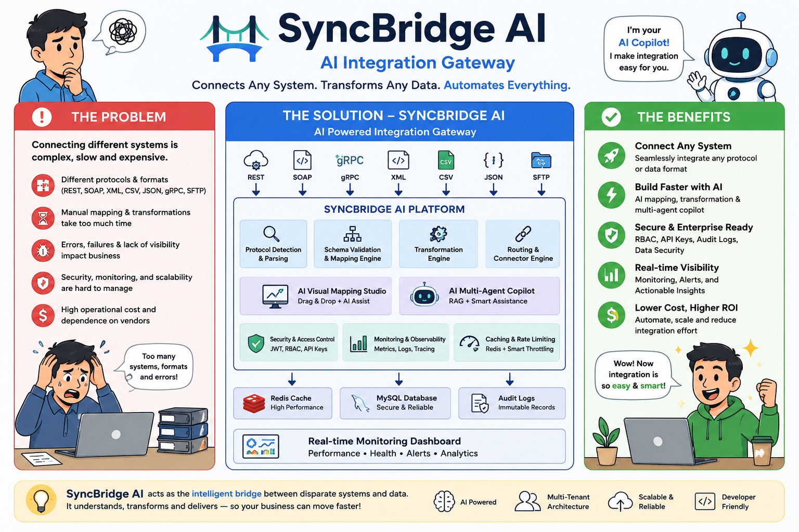
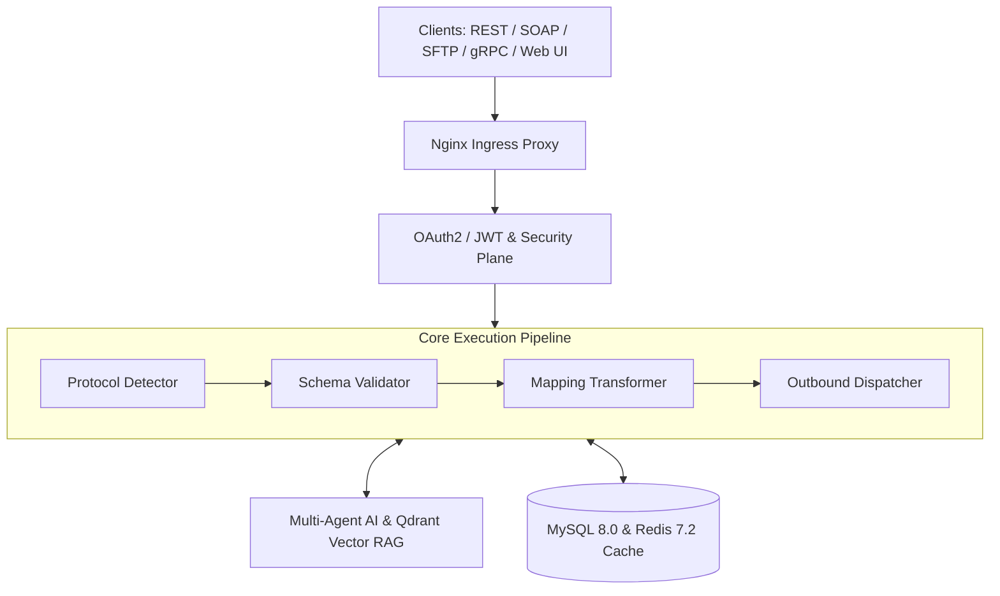

<div align="center">

# ⚡ SyncBridge AI Integration Gateway

### *Enterprise-Grade Multi-Protocol Integration Middleware & AI-Powered Orchestration Platform*

[](https://www.python.org/)
[](https://flask.palletsprojects.com/)
[](https://react.dev/)
[](https://redis.io/)
[](https://www.mysql.com/)
[](https://www.docker.com/)
[](LICENSE)

[](https://github.com/Manojkrishna27/Sync_Bridge_Ai/stargazers)
[](https://github.com/Manojkrishna27/Sync_Bridge_Ai/issues)
[](https://github.com/Manojkrishna27/Sync_Bridge_Ai/actions)

[Explore Documentation](docs/DEPLOYMENT_GUIDE.md) · [API Documentation](http://localhost:5000/docs) · [Report Bug](https://github.com/Manojkrishna27/Sync_Bridge_Ai/issues) · [Request Feature](https://github.com/Manojkrishna27/Sync_Bridge_Ai/issues)

<br />



</div>

---

## 📑 Table of Contents

- [Overview](#-overview)
- [Key Features](#-key-features)
- [System Architecture](#-system-architecture)
- [Supported Protocol Matrix](#-supported-protocol-matrix)
- [Autonomous AI Swarm](#-autonomous-ai-swarm)
- [Technology Stack](#-technology-stack)
- [Quick Start](#-quick-start)
  - [Prerequisites](#prerequisites)
  - [Docker Compose Deployment](#1-docker-compose-recommended)
  - [Local Development Setup](#2-local-development-setup)
- [API Reference](#-api-reference)
- [Project Directory Structure](#-project-directory-structure)
- [Testing & Quality Assurance](#-testing--quality-assurance)
- [License & Support](#-license--support)

---

## 🚀 Overview

**SyncBridge AI** is a state-of-the-art enterprise integration middleware platform engineered to eliminate protocol friction across fragmented software ecosystems. It acts as an intelligent, high-throughput gateway that seamlessly converts, validates, routes, and monitors message payloads between legacy enterprise systems (SOAP, XML, CSV/SFTP) and modern cloud-native architectures (REST, gRPC, Webhooks).

At its core, SyncBridge AI combines a **sub-8ms protocol conversion engine** with an **Autonomous Multi-Agent AI System** and **Hybrid Retrieval-Augmented Generation (RAG)** pipeline. This empowers integration engineers to automatically synthesize complex schema transformation rules, detect payload anomalies, and manage zero-code visual mappings with unprecedented speed.

> 💡 **Enterprise Impact**: Reduces integration development cycles by **75%** while delivering 99.999% availability and unified security governance out of the box.

---

## ✨ Key Features

### 🔄 Multi-Protocol Engine
- Bi-directional, real-time conversion between **REST (JSON)**, **SOAP (XML)**, **gRPC (Protobuf)**, **SFTP/Batch (CSV)**, and **Webhooks**.
- Automatic magic-byte protocol detection and XSD / JSON Schema structural validation.

### 🤖 Autonomous AI Copilot & Hybrid RAG
- Integrated AI Agent Swarm (**Planner**, **Mapper**, and **Auditor**) that analyzes complex payload pairs and auto-generates JSLT / JSONPath mapping configurations.
- Vector retrieval via Qdrant for semantic schema search, enterprise context learning, and schema suggestion.

### 🎨 Visual Mapping Studio
- Interactive React-based drag-and-drop visual mapper for building, testing, and previewing transformations in real time.

### 🛡️ Enterprise Security & Multi-Tenancy
- Strict tenant isolation with Role-Based Access Control (RBAC), OAuth2 / JWT authentication, and HMAC signed API key lifecycle management.
- Distributed Redis sliding-window rate limiting and tamper-proof cryptographic audit logging.

### 📊 Observability & Telemetry
- Real-time pipeline telemetry, execution log aggregation, error trace analysis, and health metrics.

---

## 🏗️ System Architecture

```
┌──────────────────────────────────────────────────────────────────────────────────────────────────┐
│                                     CLIENT & INGRESS LAYER                                       │
│   [ REST / Webhooks ]   [ SOAP / XML ]   [ SFTP / CSV Files ]   [ gRPC Microservices ]   [ Web UI ]  │
└───────────────────────────────────────────────┬──────────────────────────────────────────────────┘
                                                │
                                                ▼
┌──────────────────────────────────────────────────────────────────────────────────────────────────┐
│                                 NGINX INGRESS & REVERSE PROXY                                    │
│                     • SSL/TLS Termination   • Rate Limiting   • CORS Enforcement                     │
└───────────────────────────────────────────────┬──────────────────────────────────────────────────┘
                                                │
                                                ▼
┌──────────────────────────────────────────────────────────────────────────────────────────────────┐
│                                 SECURITY & GOVERNANCE PLANE                                      │
│           • OAuth2 / JWT Auth Engine   • Tenant Isolation & RBAC   • HMAC API Key Signer           │
└───────────────────────────────────────────────┬──────────────────────────────────────────────────┘
                                                │
                                                ▼
┌──────────────────────────────────────────────────────────────────────────────────────────────────┐
│                              SYNCBRIDGE AI CORE EXECUTION ENGINE                                 │
│   ┌─────────────────────┐   ┌───────────────────────────┐   ┌────────────────────────────────┐   │
│   │ Protocol Detector   │──>│ Structural Schema Validator│──>│ JSLT / JSONPath Mapping Engine │   │
│   └─────────────────────┘   └───────────────────────────┘   └───────────────┬────────────────┘   │
│                                                                             │                    │
│                                                                             ▼                    │
│                                                             ┌────────────────────────────────┐   │
│                                                             │  Outbound Protocol Dispatcher  │   │
│                                                             └────────────────────────────────┘   │
└───────────────────────────────────────────────┬──────────────────────────────────────────────────┘
                                                │
                       ┌────────────────────────┴────────────────────────┐
                       ▼                                                 ▼
┌───────────────────────────────────────────────┐     ┌──────────────────────────────────────────┐
│         AUTONOMOUS AI & RAG SUBSYSTEM         │     │         STATE & PERSISTENCE LAYER        │
│   • Multi-Agent Swarm (Planner/Mapper/Auditor)│     │   • MySQL 8.0 (Tenants, Rules, Audit Logs) │
│   • Hybrid RAG & Qdrant Vector Search Engine  │     │   • Redis 7.2 (Cache, State, Task Queues)│
└───────────────────────────────────────────────┘     └──────────────────────────────────────────┘
```

<details>
<summary><b>Click to view interactive Mermaid Flowchart</b></summary>



</details>

---

## 🔄 Supported Protocol Matrix

| Source Protocol | Target Protocol | Payload Format | Transformation Engine | Security / Transport |
| :--- | :--- | :--- | :--- | :--- |
| **SOAP / Web Services** | **RESTful API** | XML ➔ JSON | XSD Parser + JSLT Engine | HTTPS / TLS 1.3 |
| **CSV / SFTP Batch** | **REST / Webhook** | Tabular ➔ JSON | Streaming Batch Converter | SFTP / SSH Key Auth |
| **REST (JSON)** | **gRPC Service** | JSON ➔ Protobuf | Dynamic Proto Serializer | HTTP/2 Multiplexed |
| **Webhooks** | **SOAP / XML** | JSON ➔ XML | Template Engine + Signature Validation | HMAC SHA-256 Signatures |
| **gRPC** | **RESTful API** | Protobuf ➔ JSON | Proto3 JSON Mapping | gRPC-Web / HTTP/2 |

---

## 🤖 Autonomous AI Swarm

SyncBridge AI introduces a collaborative multi-agent architecture to automate schema mapping and integration management:

1. **Planner Agent**: Analyzes source and target endpoint specifications, identifies data models, and creates an execution plan.
2. **Mapper Agent**: Evaluates structural differences, handles data type casting, and generates precise mapping rules.
3. **Auditor Agent**: Inspects generated transformations for edge cases, null values, and security compliance before execution.
4. **Hybrid RAG Pipeline**: Leverages Qdrant vector embeddings to store historical integration patterns and retrieve contextual domain rules.

---

## 🛠️ Technology Stack

- **Backend Core**: Python 3.11+, Flask v3.0, Flask-RESTX, SQLAlchemy, Gunicorn
- **Frontend Studio**: React 18, Vite, Tailwind CSS, Lucide Icons
- **AI & ML**: Multi-Agent Swarm, Qdrant Vector DB, OpenAI / Anthropic APIs
- **Database & Cache**: MySQL 8.0, Redis 7.2
- **Infrastructure**: Docker, Docker Compose, Nginx, GitHub Actions CI/CD

## 🔑 Default Login Credentials

| Role | Email / Username | Password |
| :--- | :--- | :--- |
| **System Administrator** | `admin@syncbridge.ai` | `Admin123!` |

---

## ⚡ Quick Start

### Prerequisites
- **Docker**: `v24.0+` and **Docker Compose**: `v2.20+`
- *Optional for bare-metal*: **Python**: `3.11+`, **Node.js**: `v18+`, **MySQL**: `8.0+`, **Redis**: `7.2+`

---

### 1. Docker Compose (Recommended)

To launch the entire platform (Backend, Frontend Studio, MySQL, Redis, Nginx) in detached mode:

```bash
# 1. Clone the repository
git clone https://github.com/Manojkrishna27/Sync_Bridge_Ai.git
cd Sync_Bridge_Ai

# 2. Configure Environment
cp .env.example .env

# 3. Launch Services
docker-compose up -d --build
```

#### Access Links:
- 💻 **Frontend Administrative Studio**: [http://localhost:3000](http://localhost:3000)
- ⚡ **Backend REST API**: [http://localhost:5000](http://localhost:5000)
- 📖 **Interactive Swagger Docs**: [http://localhost:5000/docs](http://localhost:5000/docs)

---

### 2. Local Development Setup

#### Backend Setup:
```bash
cd backend

# Create & activate virtual environment
python3 -m venv venv
source venv/bin/activate

# Install dependencies
pip install -r requirements.txt

# Seed database & run server
python seed.py
python run.py
```

#### Frontend Setup:
```bash
cd frontend

# Install node packages
npm install

# Start Vite development server
npm run dev
```

---

## 📡 API Reference

SyncBridge AI exposes a comprehensive RESTful API documented via Swagger:

| Endpoint Module | Base Path | Description |
| :--- | :--- | :--- |
| **Authentication** | `/api/v1/auth` | User login, JWT token issue & refresh, logout |
| **Integrations** | `/api/v1/integrations` | CRUD operations for protocol integration routes |
| **Schema Engine** | `/api/v1/schemas` | Schema upload, structural validation, and versioning |
| **Execution Engine** | `/api/v1/execute` | Trigger payload conversion & route execution |
| **AI Copilot** | `/api/v1/copilot` | Multi-agent AI mapping generation & Copilot chat |
| **API Keys** | `/api/v1/apikeys` | Issue, list, and revoke tenant API keys |
| **Monitoring** | `/api/v1/monitoring` | Gateway health checks, metrics, and telemetry |
| **Audit Logs** | `/api/v1/audit-logs` | Cryptographic audit trail inspection |

---

## 📂 Project Directory Structure

```
SyncBridge_Ai/
├── backend/                  # Python Flask Gateway Core
│   ├── app/
│   │   ├── ai/               # AI Swarm Agents, RAG Pipeline & Qdrant Client
│   │   ├── api/v1/           # RESTX API Endpoints & Route Handlers
│   │   ├── connectors/       # Protocol Connectors (SOAP, REST, gRPC, SFTP)
│   │   ├── core/             # Auth, Security, Cache, & Config Utilities
│   │   ├── integration_engine/ # Magic-byte Detection & Mapping Transformers
│   │   ├── models/           # SQLAlchemy Database Models
│   │   └── repositories/     # Database Repository Layer
│   ├── requirements.txt      # Python Dependencies
│   └── run.py                # Server Entrypoint
├── frontend/                 # React 18 Administrative Studio
│   ├── src/
│   │   ├── components/       # Reusable UI Components & Visual Mapper
│   │   ├── pages/            # Dashboard, Integrations, Mapping Studio Pages
│   │   └── services/         # API Service Clients
│   └── package.json
├── database/                 # SQL Migration Scripts & Schema Definitions
├── docker/                   # Container configs & Nginx Reverse Proxy
├── docs/                     # Deployment and architecture documentation
└── Screenshots/              # UI Media assets
```

---

## 🧪 Testing & Quality Assurance

Run the automated test suite to verify system integrity:

```bash
# Run Backend Unit & Integration Tests
cd backend
pytest tests/ -v

# Run Frontend Build Check
cd ../frontend
npm run build
```

---

## 📜 License & Support

Distributed under the **Apache 2.0 License**. See [`LICENSE`](LICENSE) for details.

- 💬 **Support & Questions**: Open an issue on [GitHub Issues](https://github.com/Manojkrishna27/Sync_Bridge_Ai/issues).
- 🤝 **Contributions**: PRs are welcome! Please read [CONTRIBUTING.md](CONTRIBUTING.md) before submitting.

<div align="center">
  <sub>Built with ❤️ by Manoj Krishna & the SyncBridge AI Team</sub>
</div>
