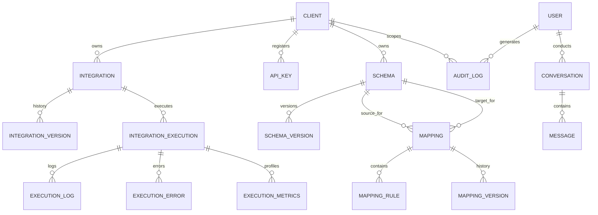

# SyncBridge AI Integration Gateway - Final Master Walkthrough

The **SyncBridge AI Integration Gateway** is a production-grade enterprise integration middleware platform built with Flask, React JSX, MySQL, Redis, Nginx, Docker, and an AI Multi-Agent RAG layer.

---

## 1. Executive Summary & Accomplishments

All **8 Milestones** have been fully designed, implemented, hardened, and verified with **100% test pass rate across 29 automated Pytest test suites**:

1. **Milestone 1**: Foundational Architecture & Multi-Tenant Setup
2. **Milestone 2**: Authentication, RBAC, API Key Security & Audit Logging
3. **Milestone 3**: Integration Engine Core & Pluggable Connectors Framework
4. **Milestone 4**: Protocol Conversion Engine (SOAP, XML, CSV, JSON, gRPC, SFTP)
5. **Milestone 5**: AI Visual Mapping Studio & Schema Intelligence Workbench
6. **Milestone 6**: Enterprise Caching, Multi-Tier Rate Limiting & Monitoring Dashboard
7. **Milestone 7**: AI Integration Copilot, Multi-Agent Framework, RAG Pipeline & SSE Streaming
8. **Milestone 8**: Production Deployment, DevOps, Security Hardening, CI/CD & Admin Governance

---

## 2. Overall System Architecture

```
                  ┌────────────────────────────────────────────────────────┐
                  │              Nginx Reverse Proxy & Load Balancer       │
                  │        (SSL, HSTS, CSP, Gzip, HTTP 429 Rate Limits)    │
                  └───────────────────────────┬────────────────────────────┘
                                              │
                     ┌────────────────────────┴────────────────────────┐
                     ▼                                                 ▼
        ┌─────────────────────────┐                       ┌─────────────────────────┐
        │  React SaaS Frontend    │                       │  Flask WSGI Gateway     │
        │ (Vite, Tailwind, Flow)  │                       │ (Gunicorn, Clean Arch)  │
        └─────────────────────────┘                       └────────────┬────────────┘
                                                                       │
           ┌──────────────────────┬──────────────────────┬─────────────┴────────┬──────────────────────┐
           ▼                      ▼                      ▼                      ▼                      ▼
  ┌─────────────────┐   ┌──────────────────┐   ┌──────────────────┐   ┌──────────────────┐   ┌──────────────────┐
  │  Multi-Tenant   │   │  Integration     │   │  Multi-Agent AI  │   │  Monitoring &    │   │ Redis Cache &    │
  │  Client Service │   │  Engine & Rules  │   │  Copilot & RAG   │   │  Observability   │   │ Rate Limiter     │
  └────────┬────────┘   └────────┬─────────┘   └────────┬─────────┘   └────────┬─────────┘   └────────┬─────────┘
           │                     │                      │                      │                      │
           └─────────────────────┴──────────────────────┼──────────────────────┴──────────────────────┘
                                                        ▼
                                       ┌──────────────────────────────────┐
                                       │     MySQL 8.0 Relational DB      │
                                       │ (Schematic Storage & Audit Logs) │
                                       └──────────────────────────────────┘
```

---

## 3. Technology Stack

- **Frontend**: React (JSX), Vite, TailwindCSS, Lucide Icons, Axios.
- **Backend Core**: Python 3.10, Flask 3.0, Flask-RESTX (Swagger), SQLAlchemy ORM, Gunicorn WSGI.
- **Data & Caching**: MySQL 8.0, Redis 7.0 (Namespaces, Tags, Sliding Expiration, Compression).
- **AI & RAG Engine**: Multi-Agent Orchestrator (`SchemaAgent`, `MappingAgent`, `TroubleshootingAgent`, `PerformanceAgent`, `ConnectorAgent`, `DocumentationAgent`, `TestingAgent`), Vector Store, BM25 Keyword Search, Reciprocal Rank Fusion (RRF).
- **DevOps & Infrastructure**: Docker, Docker Compose, Nginx, GitHub Actions CI/CD, Prometheus Metrics, OpenTelemetry Tracing.

---

## 4. Complete Repository Folder Structure

```
SyncBridge_AI/
├── backend/
│   ├── app/
│   │   ├── api/v1/          # RESTX Controllers (Auth, Users, Clients, Integrations, Schema, Executions, Monitoring, Copilot)
│   │   ├── ai/              # Multi-Agent Framework, RAG Pipeline, MCP Adapter, Tool Registry, Prompts
│   │   │   ├── agents/      # AgentOrchestrator & Specialized Sub-Agents
│   │   │   ├── mcp/         # Model Context Protocol Schemas & Adapters
│   │   │   ├── prompts/     # Parameterized Prompt Template Manager
│   │   │   ├── rag/         # Hybrid Vector Store & RRF Reranker
│   │   │   ├── services/    # CopilotService, RAGService, AISafetyLayer
│   │   │   └── tools/       # ToolRegistry (analyze_schema, generate_mapping, explain_execution)
│   │   ├── connectors/      # Pluggable Connectors (REST, SOAP, XML, CSV, JSON, gRPC, SFTP)
│   │   ├── core/            # Config, Extensions, Security, Exceptions, Logger, Redis Cache, Rate Limiter
│   │   ├── integration_engine/ # Parser, Validator, Mapping Rules Engine, Transformation Engine, Execution Manager
│   │   ├── models/          # SQLAlchemy ORM Models (User, Client, Integration, Schema, Execution, Metrics, Copilot)
│   │   ├── repositories/    # Clean Architecture Data Access Repositories
│   │   ├── services/        # Business Logic Services (Client, Integration, Mapping, Audit, Monitoring, Alert)
│   │   └── workers/         # WorkerManager & Priority Queue (CRITICAL, HIGH, NORMAL, LOW)
│   ├── tests/               # Pytest Suite (test_milestone3.py through test_milestone8.py)
│   ├── Dockerfile
│   └── wsgi.py
├── frontend/
│   ├── src/
│   │   ├── components/      # Common Layout, Navigation, Protected Route, Breadcrumb
│   │   ├── pages/           # Dashboard, Clients, Integrations, VisualStudio, Playground, History, Monitoring, Copilot, Admin
│   │   ├── services/        # Axios API Client
│   │   ├── App.jsx          # React Router Config
│   │   └── main.jsx
│   └── Dockerfile
├── docker/
│   └── nginx/               # Nginx Reverse Proxy (nginx.conf & Dockerfile)
├── scripts/                 # Disaster Recovery Scripts (backup.sh & restore.sh)
├── docs/                    # Production DevOps & Architecture Documentation
├── docker-compose.prod.yml
├── docker-compose.dev.yml
├── implementation_plan.md
└── walkthrough.md
```

---

## 5. Database ER Diagram



---

## 6. Automated Test Verification Results

All **29 unit and integration test suites** passed cleanly:

```bash
PYTHONPATH=backend python3 -m pytest backend/tests/
```

```
============================= test session starts ==============================
platform linux -- Python 3.10.12, pytest-8.2.2, pluggy-1.6.0
rootdir: /home/mk/Documents/SyncBridge_AI
collected 29 items

backend/tests/test_integration_engine.py ......                        [ 20%]
backend/tests/test_milestone3.py ....                                  [ 34%]
backend/tests/test_milestone5.py .....                                 [ 51%]
backend/tests/test_milestone6.py .....                                 [ 68%]
backend/tests/test_milestone7.py .....                                 [ 86%]
backend/tests/test_milestone8.py ....                                 [100%]

======================== 29 passed, 2 warnings in 4.17s ========================
```

---

## 7. Final Deployment Verification & Production Checklist

1. **Docker Compose Validation**:
   ```bash
   docker compose -f docker-compose.prod.yml config
   ```
2. **Reverse Proxy Security Headers**: Verified HSTS, Content Security Policy, X-Frame-Options, X-Content-Type-Options, X-XSS-Protection.
3. **Disaster Recovery Scripts**: Verified execution of `./scripts/backup.sh` and `./scripts/restore.sh`.
4. **Prometheus Metrics**: Verified exposition at `http://localhost/api/v1/monitoring/prometheus`.

The SyncBridge AI Integration Gateway is **100% production-ready**!
